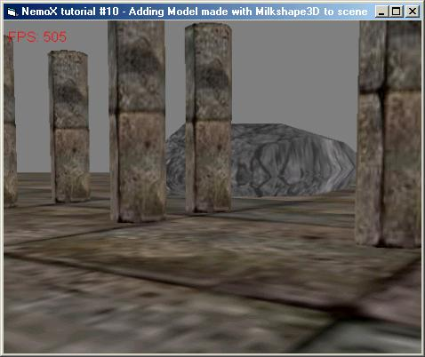



## NemoX 3D engine tutorial 10 \-How to load milkshape3D mesh and perform smooth collision detection

### Description

This tutorial is the 10th that comes with NemoX engine: to demonstrate how meshes made by the popular Milshape3d modeler can be loaded and rendered fastly.

For more details on how use NemoX engine classes

check at the Engine website

www.nemox.fr.st

I'M SORRY PEOPLE YOU NEED TO DOWNLOAD THE ADDITIONAL ENGINE FILE AT nemox.fr.st

direct link:

http://perso.wanadoo.fr/malakoff/NemoXsetup.exe

leave feedbacks.
 
### More Info
 

             |
---                |---
**Submitted On**   |2003-04-08 17:51:08
**By**             |[polaris](https://github.com/Planet-Source-Code/PSCIndex/blob/master/ByAuthor/polaris.md)
**Level**          |Intermediate
**User Rating**    |5.0 (10 globes from 2 users)
**Compatibility**  |VB 4\.0 \(32\-bit\), VB 5\.0, VB 6\.0
**Category**       |[Coding Standards](https://github.com/Planet-Source-Code/PSCIndex/blob/master/ByCategory/coding-standards__1-43.md)
**World**          |[Visual Basic](https://github.com/Planet-Source-Code/PSCIndex/blob/master/ByWorld/visual-basic.md)
**Archive File**   |[NemoX\_3D\_e1572164102003\.zip](https://github.com/Planet-Source-Code/polaris-nemox-3d-engine-tutorial-10-how-to-load-milkshape3d-mesh-and-perform-smooth-collis__1-44663/archive/master.zip)

